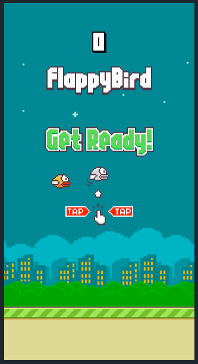

# Flappy Bird

> Flappy Bird mobile game clone for web



Flappy Bird is a side-scroller where the player controls a bird, attempting to fly between columns of green pipes without hitting them.

## Built With

- Phaser 3

## Live Demo

[Live Demo Link](https://blissful-wiles-7bf90a.netlify.app/)

## Getting Started

To get a local copy up and running follow these simple example steps.

### Prerequisites

- NodeJS - [v16.x](https://nodejs.org/en/)

### Setup

```bash
git clone https://github.com/usmansbk/flappy-bird.git
cd ./flappy-bird
```

### Install

```bash
npm install
```

### Usage

```bash
npm start
```

### Build

```bash
npm run build
```

### Run tests

```bash
npm test
```

## Authors

👤 **Babakolo Usman Suleiman**

- GitHub: [@usmansbk](https://github.com/usmansbk)
- LinkedIn: [LinkedIn](https://www.linkedin.com/in/usman-suleiman-82b444140/)

## 🤝 Contributing

Contributions, issues, and feature requests are welcome!

Feel free to check the [issues page](../../issues/).

## Show your support

Give a ⭐️ if you like this project!

## Acknowledgments

- [Flappy Bird mobile game by Dong Nguyen](https://en.wikipedia.org/wiki/Flappy_Bird)

## 📝 License

This project is [MIT](./MIT.md) licensed.
